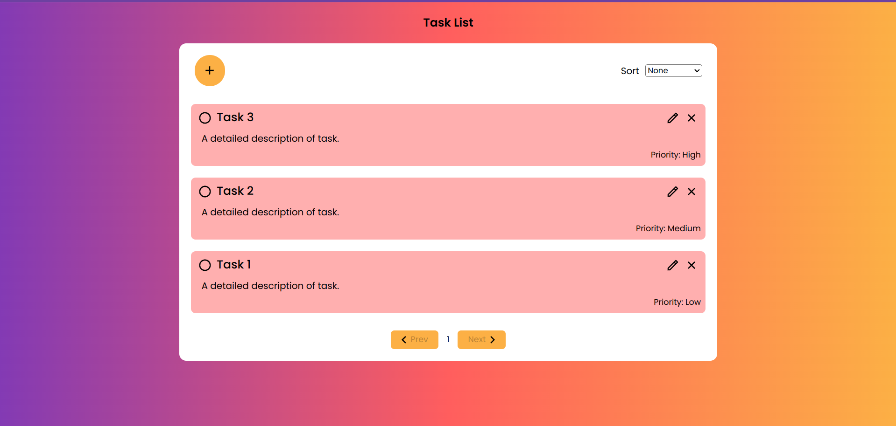

# Task Management Application

This is a Task Management Application built using React. The application allows users to manage their tasks by adding, editing, deleting, and marking tasks as completed. It also provides features such as task prioritization and persistent data storage in the browser's local storage.

## Project Structure

The project follows a modular structure with three main components:

1. **TaskList Component:**

   - Displays a list of tasks with the task name, description, priority, and status.
   - Allows users to mark tasks as completed by clicking on a checkbox.
   - Includes a button to delete tasks.
   - Provides a visual indication of completed tasks with a strike-through.

2. **AddTask Component:**

   - Includes a modal/form for adding new tasks.
   - Form fields include task name, task description, and priority level (low, medium, high).
   - Implements validation to ensure that the task name is required.

3. **EditTask Modal/Form Component:**
   - Allows users to edit the task name, description, and priority.
   - Provides an edit button for each task that opens the edit task modal/form.

## Routing

The application utilizes React Router for navigation between different pages:

- `/` - Task List page
- `/add` - Add Task page
- `/edit/:id` - Edit Task page with the task ID as a parameter

## State Management

React state is used within each component to manage their respective functionalities. Context or state lifting is employed to share state between components when necessary.

## LocalStorage

Tasks are stored in the browser's local storage, ensuring that tasks persist even after a page refresh. This provides a seamless user experience without the loss of data.

## Styling

The application features a responsive design achieved through CSS. The interface is designed to be visually appealing and user-friendly.

## Testing

Unit tests are written for critical components (TaskList, AddTask, EditTask) using Jest, a popular testing library. These tests ensure the reliability and correctness of the application.

## Bonus Features (Optional)

- **Sorting:** Tasks can be sorted based on priority or completion status.
- **Pagination:** Pagination is implemented for the task list, enhancing usability for users with a large number of tasks.

## Getting Started

1. Clone the repository.
2. Run `npm install` to install dependencies.
3. Run `npm start` to start the development server.
4. Open the application in your browser at `http://localhost:1234`.

Feel free to explore, add tasks, edit them, and manage your to-do list seamlessly with this Task Management Application!

## Project Screenshots

